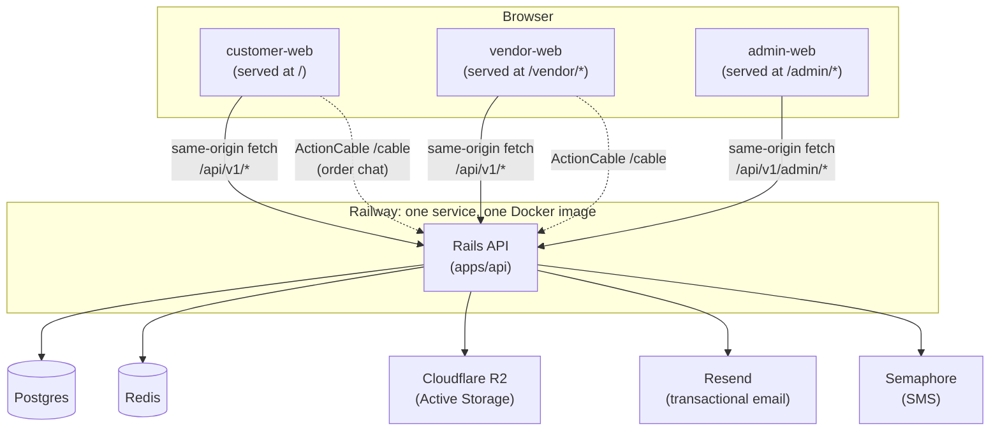

# Architecture

How the pieces of KapitMarket PH talk to each other. `docs/adr/` has the
*why* behind each decision; `docs/erd.md` has schema detail. This page is
the *how*: request flow, deployables, and the two auth models.

## One image, four deployables

One Rails API (`apps/api`) and three separate Vite/React SPAs
(`apps/customer-web`, `apps/vendor-web`, `apps/admin-web`) build into a
**single Docker image** and run as **one Railway service**. There is no
API gateway, no reverse proxy in front of Rails, no separate static
hosting — Rails serves everything.

The Dockerfile (`apps/api/Dockerfile`) has three Node build stages (one
per SPA) that each run `npm run build`, then copies each `dist/` into the
Rails image's `public/` tree: customer-web's build goes to
`public/`, vendor-web's to `public/vendor/`, admin-web's to
`public/admin/`. Because the build needs to see all three frontend
directories plus `apps/api`, **the build context is the repo root, not
`apps/api`** — a `railway up` deploy must be run with `--path-as-root .`
from the repo root, pointed at `apps/api/Dockerfile`.

`config/routes.rb`'s `StaticController` serves each SPA's `index.html`
for any client-side route under its prefix (so React Router can take
over after the initial load), with a `RESERVED_PATH_PREFIXES` guard
(`/api`, `/rails`, `/cable`, `/up`, `/sidekiq`) so the customer-web
catch-all — which must be the *last* route drawn, since it matches
everything — never shadows the API, ActiveStorage, ActionCable, the
health check, or Sidekiq's dashboard. Real static assets (JS/CSS bundles,
images) are served directly by Rack::Static before any of this runs;
`StaticController` only ever serves the `index.html` shell.

**Deploys are manual, not git-triggered.** Railway's `api` service has no
connected source — pushing to GitHub does nothing. The only way a commit
reaches production is running `railway up --service api --path-as-root .
--detach` from the repo root. This has caused real confusion (the live
site ran days-old code while local commits kept landing) — there is no
CI/CD pipeline here yet, just this one manual command.

## Two auth models, deliberately not unified

**Customer/vendor auth** (`Authentication` concern, `apps/api/app/controllers/concerns/authentication.rb`):
bearer token in `Authorization: Bearer <token>`, looked up by digest via
`ApiToken`. One `User` can hold both a `customer_profile` and a
`vendor_profile` — it's capability-based, not a role column, and signing
in on either customer-web or vendor-web signs you in on both (same
`kapitmarket_token` localStorage key, same-origin now that both are
served from one Rails app). `authenticate!` requires a valid token;
`authenticate_optionally!` (used by `feedback` and `client_errors`, which
must work for anonymous callers too) attributes the request to a user
when a token happens to be present, without requiring one.

**Admin auth** (`Api::V1::Admin::BaseController`): real per-admin accounts
(`AdminUser`, `has_secure_password`) and bearer-token sessions
(`AdminApiToken`, SHA-256 digest storage, 30-day TTL), not the old shared
HTTP Basic Auth credential. `AdminUser`/`AdminApiToken` are a deliberately
isolated model set — not the same rows as `User`/`ApiToken`, not a
polymorphic extension of them — mirroring that *pattern* rather than
reusing it, matching this repo's existing preference for duplication over
cross-cutting shared abstractions (`ADR 0001`, extended here to a second
axis: admin identity is architecturally separate from marketplace-user
identity, not just a role flag on it). The `Admin::Authentication` concern
resolves the bearer token, rejects a missing/invalid/expired token or one
belonging to a suspended admin, and sets `current_admin_user` — checked on
**every request**, so deactivating an admin revokes access immediately,
not just at their next login. This inherits `ApplicationController`
directly, not `Api::V1::BaseController`, because bearer-token auth for
marketplace users and bearer-token auth for admins are unrelated concerns
that never overlap on the same request (see `ADR 0010`). The admin
namespace is only drawn into `config/routes.rb` at all when
`ADMIN_ENABLED=true` — in production, without that env var, the routes
don't exist. The Sidekiq::Web dashboard at `/sidekiq` is intentionally
left on its own, separate `SIDEKIQ_WEB_USERNAME`/`PASSWORD` Basic Auth
pair — different tool, different audience, out of scope for this change
(`ADR 0010`).

Every mutating admin request (POST/PATCH/PUT/DELETE) is attributed to the
signed-in admin via one `around_action :record_audit_log` hook on
`Api::V1::Admin::BaseController`, writing an `AdminAuditLog` row (admin,
HTTP method, path, controller/action, resource type/id, status code,
filtered params, IP). This is a single-file addition, not something
touched per-controller, since all 16+ admin resource controllers already
inherit the same base. Reads are deliberately not logged — the ask this
answers is "who did this," not a full request log. Audit log rows are
browsable read-only via `GET /api/v1/admin/audit_logs` (and admin-web's
Audit log page), filterable by `admin_user_id`/`resource_type`.

The very first `AdminUser` is bootstrapped via `admin_users:create` (a
rake task, aborts if any admin already exists); every admin after that is
created self-service from admin-web's Admin accounts page
(`Api::V1::Admin::AdminUsersController`), which also handles
deactivate/reactivate. Deactivating an admin immediately expires their
active tokens; an admin can't deactivate their own account (self-lockout
guard).

admin-web's login screen prompts for email/password against
`POST /api/v1/admin/auth/login`, storing the returned bearer token in its
own localStorage key (`kapitmarket_admin_token`) — distinct from the
customer/vendor `kapitmarket_token` key, so the two apps' sessions never
mix, same as before.

## admin-mcp is a client, not a backdoor

`admin-mcp/` is a small TypeScript MCP server that wraps the admin API
(`Api::V1::Admin::*`) as a set of MCP tools — `read.ts` for list/show
tools, `mutate.ts` for state-changing ones (suspend a user, resolve a
feedback submission, etc.). It authenticates with a bearer `AdminApiToken`
(`ADMIN_TOKEN` env var) over the same HTTP endpoints admin-web uses. It
has no special access, no service-role token, and no direct database
connection — it's a second HTTP client of the same admin API admin-web
already uses. Because it's a long-running local process with no login
flow, its token is pre-minted out-of-band via `admin_users:mint_token`
(a rake task, defaults to a 180-day TTL) rather than obtained through the
HTTP login endpoint, which always issues the standard 30-day token. Every
mutate tool still requires `confirm: true` or it dry-runs, a
code-enforced branch (not just a description hint) so an agent calling
these tools can't accidentally suspend a user or delete a row without an
explicit confirmation flag — and every such call is attributed to
whichever `AdminUser` the token belongs to in the audit log, same as any
admin-web action.

## Request flow: placing an order through to chat

1. **Discovery** (M2): customer-web calls `GET /api/v1/shops`, which
   returns open shops in a *daily-rotating* order (`ADR 0007` — never
   alphabetical, so no shop is permanently first). Each shop's
   `average_rating`/`ratings_count` (Workstream A) are always-public
   fields on `ShopSerializer`, not gated behind any auth check.
2. **Cart** (`ADR 0008`, cart reintroduced after being briefly deferred):
   `Api::V1::CartController` scopes a cart to one shop at a time.
   Anonymous visitors get a **localStorage-backed guest cart**
   (`apps/customer-web/src/guestCart.ts`); on login, the guest cart's
   lines are replayed against the real backend cart one `addCartItem`
   call at a time, then cleared. An account is only required at
   checkout, not to add items.
3. **Checkout**: `Carts::Checkout` snapshots prices/names into
   `order_items` at placement — orders are historical records, never
   re-reading live item data afterward.
4. **Order lifecycle + chat** (M3/M4, `ADR 0009`): `Orders::TransitionStatus`
   drives status changes; each transition posts a `system` chat message
   (so the conversation itself is the audit trail a customer/vendor sees).
   `OrderPolicy`/`ConversationPolicy` unify ownership checks for both the
   customer and vendor side of the same order, so one controller pair
   (`OrdersController`, `ConversationsController`) serves both roles
   rather than duplicating one per namespace — only the *list* endpoints
   differ (`GET /orders` for a customer's own orders vs.
   `GET /vendor/orders` for a vendor's shop orders).
5. **Chat delivery**: `ActionCable::Server` mounted at `/cable`.
   WebSocket connections can't carry an `Authorization` header, so the
   bearer token is passed as a `?token=` query param instead
   (`ApplicationCable::Connection`).
6. **Rating** (Workstream A, M4): once `order.status == "completed"`,
   the customer can `POST /orders/:id/ratings` exactly once
   (`Ratings::Create` enforces both the completed-status gate and that
   the reviewer is that order's own customer; a DB uniqueness constraint
   on `(order_id, reviewer_user_id, reviewee_type, reviewee_id)` is the
   actual backstop). The rating is public — it shows on the shop's page
   and read-only in vendor-web.
7. **Private vendor notes** (Workstream B): independent of ratings, a
   vendor can attach a private note (plus a "flagged" boolean) to a
   customer from an order's detail page. Visibility is enforced at the
   query layer — every vendor-facing read is scoped through
   `current_vendor_profile.vendor_customer_notes`, so there is no
   endpoint that can return another vendor's notes about the same
   customer. The admin namespace is the one exception, with cross-vendor
   read access, for investigating disputes.

## Error monitoring (Workstream C): internal only

No Sentry, no Rollbar, no third-party SDK — a deliberate call to avoid
adding another paid external service. `ErrorLog.record!` dedupes by a
SHA256 fingerprint of exception class + message + top backtrace line;
repeats bump `occurrences_count`/`last_seen_at` instead of growing the
table unbounded. A `rescue_from StandardError` in the shared
`ErrorHandling` concern (declared *first*, since `ActiveSupport::Rescuable`
matches handlers bottom-to-top — putting the catch-all last would have
shadowed every specific handler below it) means an unexpected backend
exception still returns the API's standard `{ error: {...} }` envelope
instead of a bare Rails HTML 500, while also recording it. `ErrorAlertJob`
sends one Resend email per *new* fingerprint only (not every repeat), to
the same operator address already used for feedback notifications. Each
frontend SPA has a small `ErrorBoundary` component plus an
`unhandledrejection` listener, both reporting to a public
`POST /api/v1/client_errors` endpoint. Everything is browsable in
admin-web's Error logs page and via admin-mcp's `error_logs` tools —
the same resolve!/reopen! pattern already used for feedback submissions.

## What this page deliberately leaves out

Domain model detail (`docs/erd.md`), the reasoning behind any specific
decision (`docs/adr/`), and milestone-by-milestone scope
(`docs/milestones.md`) all live elsewhere and aren't repeated here.
