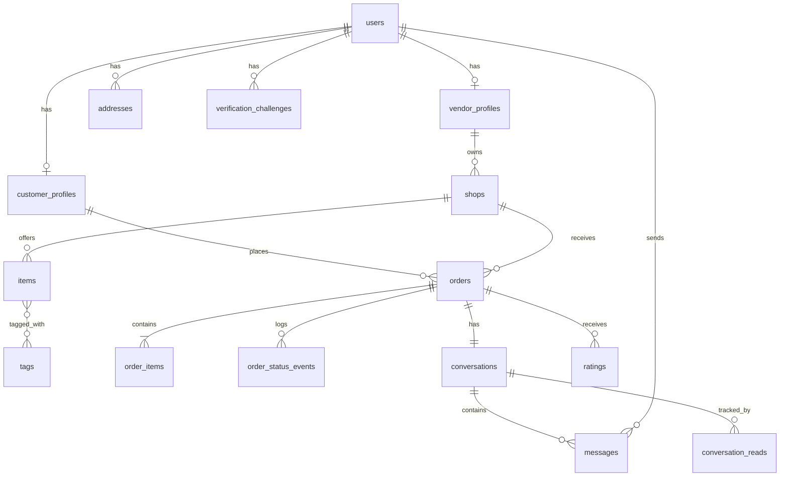

# Data model (ERD)

Scope: the current build phase (M0–M4). Tables that only exist to support a
cart or order edits are **not** created yet and are listed at the bottom as
deferred.

## Diagram

## Identity

**users**
- `id`, `email` (normalized, unique), `mobile_number` (normalized, unique)
- `password_digest`
- `email_verified_at`, `mobile_verified_at` (nullable)
- `status`, `last_signed_in_at`
- timestamps

A user may hold a customer profile, a vendor profile, or both. Authorization
is capability-based (what profiles/ownership the user has), not a single
exclusive role column.

**customer_profiles**
- `id`, `user_id`, `display_name`, `default_address_id` (nullable)
- timestamps

**vendor_profiles**
- `id`, `user_id`, `display_name`, `verification_status`
- timestamps

**addresses** — descriptive, not geographic
- `id`, `user_id` (nullable), `label`, `recipient_name`, `mobile_number`
- `unit`, `building`, `notes` / `delivery_instructions`
- timestamps
- **No latitude/longitude.** There is no distance logic in this product
  (see ADR 0002). Addresses describe where to walk to, in words.

**verification_challenges**
- `id`, `user_id`, `channel` (email | sms), `purpose`
- `code_digest` (hashed — never store the plaintext code)
- `sent_to`, `expires_at`, `consumed_at` (nullable), `attempts_count`
- `created_at`

## Shop and catalog

**shops**
- `id`, `vendor_profile_id`, `name`, `slug` (unique)
- `description`, `contact_number`
- `address` (descriptive text — unit/building), **no lat/lng, no
  service_radius**
- `fulfillment_methods` (pickup and/or vendor delivery)
- `status` (draft | active | suspended)
- `accepting_orders` (boolean — the manual open/close switch)
- timestamps
- Shop photos via Active Storage (max 3, see ADR 0006).

**items**
- `id`, `shop_id`, `name`, `description`
- `price_cents`, `currency`
- `enabled` (boolean), `position`
- timestamps
- Item photos via Active Storage (max 6, see ADR 0006).
- A disabled item stays visible in historical orders but cannot be ordered.

**tags**
- `id`, `name`, `slug` (unique)

**item_tags**
- `item_id`, `tag_id`

## Orders (cart-free direct placement)

**orders**
- `id`, `public_reference` (unique, human-shareable)
- `customer_profile_id`, `shop_id`
- `delivery_address_id` (nullable — only for delivery fulfillment)
- `fulfillment_method` (pickup | delivery)
- `status` (see order lifecycle in ADR 0003)
- `subtotal_cents`, `total_cents`, `currency`
- `payment_method` (e.g. cash/manual), `payment_status`
- `customer_note`, `vendor_note`
- `placed_at`, `accepted_at`, `completed_at`, `cancelled_at`
- timestamps
- In this phase an order is created directly from `shop_id` + `item_id` +
  `quantity` — there is no cart. The model is shaped to accept a cart-built
  order later without change.

**order_items** — immutable snapshot at placement time
- `id`, `order_id`, `item_id` (nullable — item may later be deleted)
- `item_name`, `item_description`, `unit_price_cents`, `quantity`,
  `line_total_cents`, `customer_note`
- `created_at`
- Values are copied from the live item at placement and never re-read after.

**order_status_events** — full audit trail
- `id`, `order_id`, `from_status`, `to_status`
- `actor_user_id`, `reason`, `metadata`
- `created_at`
- Every status transition writes one row.

## Chat (per-order, image-capable)

**conversations**
- `id`, `order_id` (unique — exactly one conversation per order)
- `created_at`

**messages**
- `id`, `conversation_id`, `sender_user_id`
- `body` (nullable when the message is image-only)
- `message_type` (text | image)
- `metadata`
- `created_at`, `edited_at` (nullable)
- Optional single image attachment via Active Storage (max 1 per message,
  see ADR 0006).

**conversation_reads**
- `conversation_id`, `user_id`, `last_read_message_id` (nullable),
  `last_read_at`

## Ratings

**ratings**
- `id`, `order_id`, `reviewer_user_id`
- `reviewee_type`, `reviewee_id` (polymorphic — supports mutual ratings later
  even though this phase is customer-rates-order)
- `score`, `comment`
- timestamps
- Unique constraint on (`order_id`, `reviewer_user_id`, `reviewee_type`,
  `reviewee_id`) to prevent duplicate ratings.
- A rating is only allowed on a completed order by a participant.

## Deferred — not created this phase

- **carts**, **cart_items** — cart is a later milestone (ADR 0004).
- **order_change_requests** — order edits are out of scope (ADR 0005).
